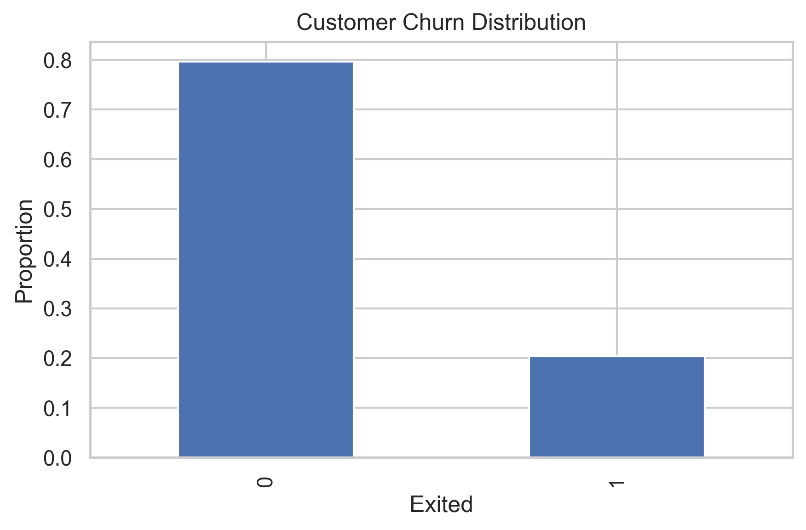
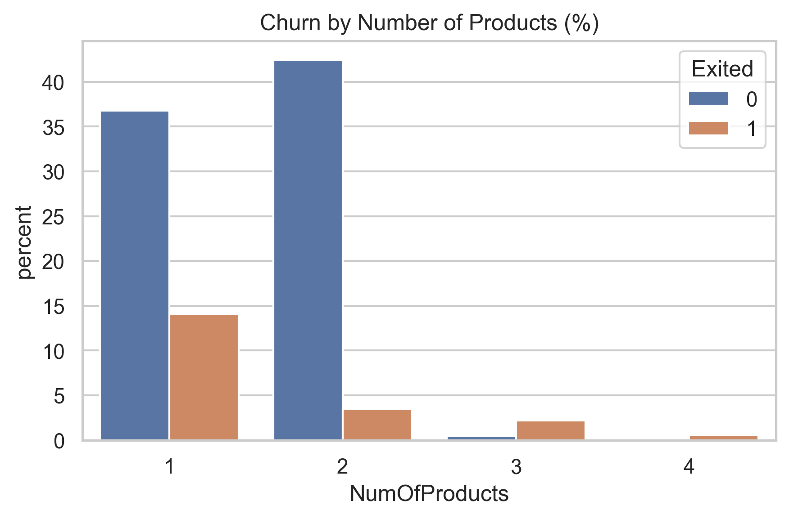
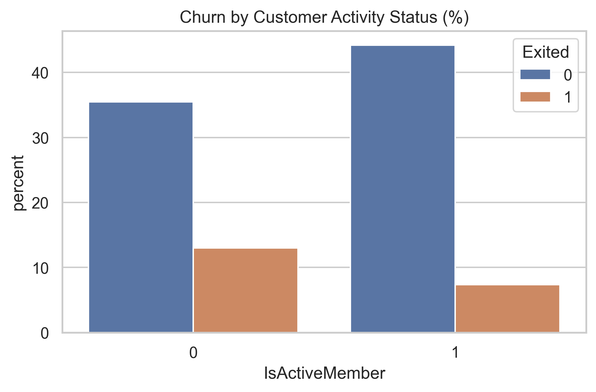
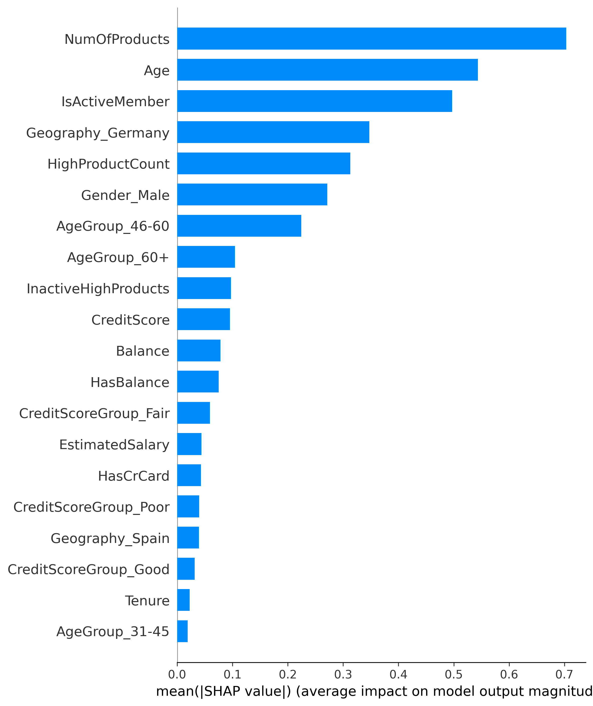

# Retail Bank Customer Churn Prediction

[](https://www.python.org/)
[](https://scikit-learn.org/stable/)
[](https://shap.readthedocs.io/en/latest/)
[](LICENSE)

---

## Project Overview

This project demonstrates an end-to-end customer churn prediction pipeline using real-world retail banking data. The objective is to identify customers at high risk of churn early enough to support proactive retention strategies, targeted outreach, and efficient resource allocation.

The project is designed as a client-ready portfolio case, emphasizing business interpretability, explainable modeling, and defensible evaluation. While the use case is retail banking, the methodology is applicable to insurance, subscription services, and other regulated, customer-centric industries.

---

## Business Context

Customer churn—customers closing accounts or discontinuing their relationship—represents a major revenue and continuity risk for retail banks. Customer acquisition costs are high, while long-term profitability depends on retention, cross-selling, and customer lifetime value.

Traditional retention programs are often reactive and broadly applied, resulting in inefficient incentive allocation and missed opportunities to retain high-risk customers. This project addresses that gap by delivering a **data-driven, proactive churn prediction system** supported by transparent, business-aligned explanations.

---

## Project Objectives

This project aims to:

- Predict customer churn risk before exit occurs  
- Identify key churn drivers with clear business interpretation  
- Enable risk-based prioritization for retention teams  
- Balance predictive performance with explainability and governance  

The solution is intentionally designed as a **decision-support system**, not a black-box model.

---

## Dataset Overview

- ~10,000 retail bank customers  
- Target variable: **Exited**
  - 1 = Customer churned  
  - 0 = Customer retained  
- Observed churn rate: ~20% (class imbalance)

**Feature domains include:**

- Demographics (Age, Gender, Geography)  
- Account lifecycle (Tenure)  
- Engagement indicators (IsActiveMember)  
- Product ownership (NumOfProducts)  
- Financial attributes (Balance, EstimatedSalary, CreditScore)  

Personally identifiable identifiers were removed to prevent data leakage.

---

## Exploratory Data Analysis (EDA)

Exploratory analysis identified clear, business-relevant churn patterns related to customer engagement, lifecycle stage, and product complexity.

### Key Findings

- Churn rate of ~20% confirms the need for recall-focused evaluation  
- **Older customers** exhibit higher churn propensity  
- **Inactive members** churn at significantly higher rates  
- Customers holding **3–4 products** show elevated churn, especially when inactive  
- Zero-balance accounts behave differently from financially engaged customers  
- Feature correlations are generally low, indicating minimal multicollinearity  

These findings confirm that churn is **multifactorial**, driven by lifecycle stage, engagement behavior, and product complexity.

### Supporting Visual Evidence

#### Overall Churn Distribution



#### Churn by Number of Products

Customers holding multiple products show elevated churn risk, particularly when engagement is low.  
This insight motivated the creation of product complexity and interaction features.



#### Customer Engagement and Churn

Inactive customers churn at significantly higher rates, making engagement status one of the strongest behavioral indicators of churn.



---

## Feature Engineering

Feature engineering focused on capturing **customer lifecycle risk, engagement behavior, and product complexity**, while maintaining interpretability:

- Age and tenure grouped into lifecycle buckets  
- Balance utilization indicators (HasBalance)  
- Product complexity flags (HighProductCount)  
- Behavioral interaction signals (InactiveHighProducts)  
- Credit score groupings for interpretability  

All features were engineered using a leakage-safe pipeline.

---

## Modeling Strategy

- Stratified train–test split  
- Feature scaling applied to training data only  
- Class imbalance handling:
  - Class-weighted learning  
  - SMOTE (training data only)

**Models evaluated:**

- Logistic Regression (Class-Weighted)  
- Logistic Regression (SMOTE)  
- Random Forest (Class-Weighted)  
- Random Forest (SMOTE)

---


## Model Performance (Test Set)

| Model                                | ROC-AUC | Recall (Churn) | Precision (Churn) | F1    |
| ------------------------------------ | ------- | -------------- | ----------------- | ----- |
| Logistic Regression (Class-Weighted) | ~0.84   | **~0.74**      | ~0.47             | ~0.57 |
| Logistic Regression (SMOTE)          | ~0.83   | ~0.55          | ~0.63             | ~0.59 |
| Random Forest (SMOTE)                | ~0.85   | ~0.52          | ~0.67             | ~0.58 |
| Random Forest (Class-Weighted)       | ~0.85   | ~0.43          | ~0.77             | ~0.55 |

**Final model selected:** **Class-Weighted Logistic Regression**

**Rationale:**

* Maximizes recall for churners (primary business objective)
* Strong discrimination ability (ROC-AUC)
* Stable, interpretable, and regulator-friendly

---

## Explainability (SHAP)

SHAP (SHapley Additive exPlanations) was used to ensure transparency and stakeholder trust.

### Global Feature Importance
The number of products, customer age, and engagement status are the strongest drivers of churn risk.



### Directional Impact of Features
The SHAP beeswarm plot illustrates how high and low feature values influence churn probability across customers.


**Top churn drivers include:**

* Number of products held
* Customer age and age group
* Activity status (active vs inactive)
* Interaction between inactivity and high product count
* Geographic and demographic factors

The analysis confirms that churn is driven primarily by **behavioral disengagement and product complexity**, not income alone.

---

## Business Use Case

In a real deployment, this system would:

* Rank customers by churn risk
* Feed churn probabilities into CRM tools
* Enable targeted retention campaigns
* Reduce unnecessary incentive spend
* Support proactive, data-driven decision-making

The model is suitable for **regulated operational environments**.

---

## Limitations & Future Work

**Limitations:**

* Snapshot-based data (no temporal modeling)
* No causal measurement of retention actions
* External market factors not included

**Next steps:**

* Time-to-event or survival modeling
* Uplift modeling for retention effectiveness
* Continuous monitoring for data drift
* A/B testing of retention strategies

---

## Dataset Access

Due to data licensing and privacy considerations, the raw customer dataset is not included in this repository.

The dataset is commonly used for educational purposes in churn modeling and contains anonymized retail banking customer records.

To reproduce results:
1. Obtain the dataset from its original public source
2. Place it under `data/raw/`
3. Run notebooks in numerical order

---

## Project Structure

```
customer_churn_prediction/
├── notebooks/
│   ├── 01_eda.ipynb
│   ├── 02_feature_engineering.ipynb
│   ├── 03_class_imbalance_baseline.ipynb
│   ├── 04_modeling_comparison.ipynb
│   └── 05_shap_explainability.ipynb
├── visuals/
│   ├── eda/
│   │   ├── churn_distribution.png
│   │   ├── products_vs_churn.png
│   │   ├── activity_vs_churn.png
│   │   └── age_vs_churn.png
│   └── figures/
│       ├── shap_global_importance_bar.png
│       └── shap_beeswarm.png
├── reports/
│   └── Retail_Bank_Customer_Churn_Prediction
├── README.md
├── LICENSE
├── requirements.txt

```
> Trained model artifacts are intentionally excluded from version control.  
> Models can be reproduced by running the notebooks in order.

---

## Disclaimer

This project is for **educational and portfolio demonstration purposes only**.  
It does not represent production-ready systems or official analyses of any financial institution.

---

## Author

**Medical AI & Healthcare Data Science Consultant**

Physician (MBBS) with a Master’s in Global Communication and professional training in Machine Learning, Deep Learning, NLP, and AI for Medicine. Experienced in building interpretable risk models and decision-support systems for regulated, data-sensitive environments.


